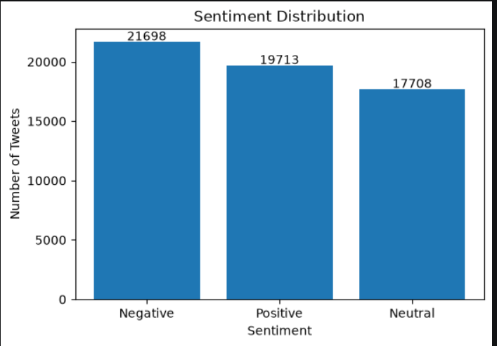
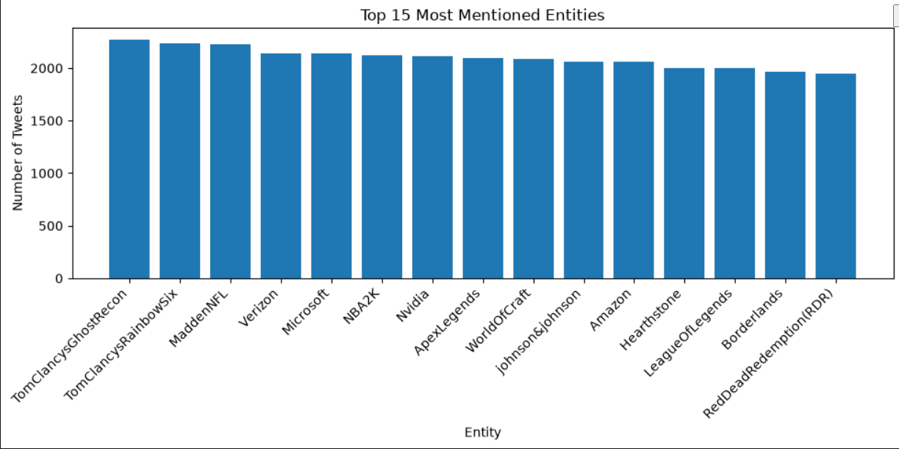
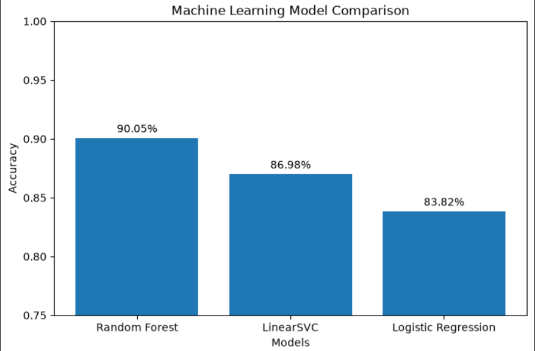
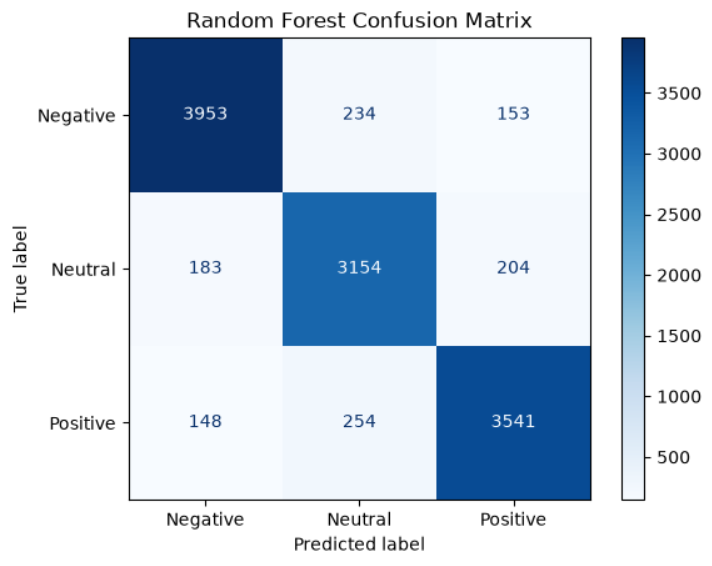

# Twitter Sentiment Analysis using Machine Learning

## Project Overview

This project is an end-to-end Machine Learning application that classifies Twitter posts into **Positive**, **Negative**, and **Neutral** sentiments.

The dataset was cleaned and preprocessed using a custom text preprocessing pipeline. The cleaned tweets were converted into numerical features using **TF-IDF Vectorization**, and multiple machine learning algorithms were trained and evaluated.

The following machine learning models were compared:

* Logistic Regression
* LinearSVC
* Random Forest
* XGBoost

Among all the evaluated models, **Random Forest** achieved the highest test accuracy of **90.05%** and was selected as the final model.

The trained model was saved using Joblib and can be used to predict the sentiment of unseen tweets.

---

## Technologies Used

* Python
* Pandas
* NumPy
* Matplotlib
* NLTK
* Scikit-learn
* XGBoost
* Joblib
* Jupyter Notebook

---

## Dataset

The project uses the **Twitter Entity Sentiment Analysis** dataset, which contains tweets related to various entities such as games, companies, and brands.

Each tweet is labeled as one of the following sentiment classes:

* Positive
* Negative
* Neutral
* Irrelevant

For this project, only the **Positive**, **Negative**, and **Neutral** classes were used. The **Irrelevant** class was removed during preprocessing to improve the quality of the classification model.

---

## Project Workflow

The project follows these steps:

1. Load the Twitter sentiment dataset.
2. Remove missing values and duplicate records.
3. Remove the **Irrelevant** sentiment class.
4. Perform Exploratory Data Analysis (EDA).
5. Preprocess tweets by:

   * Converting text to lowercase
   * Removing URLs
   * Removing special characters
   * Removing custom words (`im`, `ill`, `ive`)
   * Removing English stopwords
6. Convert text into TF-IDF features.
7. Split the dataset into training and testing sets.
8. Train multiple machine learning models.
9. Compare model performance using accuracy and confusion matrix.
10. Save the best-performing model using Joblib.
11. Predict the sentiment of new tweets.

---

## Results

| Model               | Test Accuracy |
| ------------------- | ------------: |
| Random Forest       |        90.05% |
| LinearSVC           |        86.98% |
| Logistic Regression |        83.82% |
| XGBoost             |        70.00% |

Random Forest achieved the highest accuracy and was selected as the final model for sentiment prediction.

---

## Visualizations

### Sentiment Distribution



### Top Entities



### Model Comparison



### Confusion Matrix



---

## How to Run

### Clone the repository

```bash
git clone https://github.com/Jogendra04/Twitter_Sentiment_Analysis.git
```

### Navigate to the project folder

```bash
cd Twitter-Sentiment-Analysis
```

### Create a virtual environment (optional)

```bash
python -m venv venv
```

### Activate the virtual environment

**Windows**

```bash
venv\Scripts\activate
```

**Linux / macOS**

```bash
source venv/bin/activate
```

### Install the required packages

```bash
pip install -r requirements.txt
```

### Launch Jupyter Notebook

```bash
jupyter notebook
```

Open the notebook and run all cells sequentially.

---

## Usage

After training the model, you can predict the sentiment of new tweets using the saved pipeline.

Example:

```python
print(predict_sentiment("I absolutely love this game!"))
print(predict_sentiment("This game is terrible."))
print(predict_sentiment("The game is okay."))
```

Example Output:

```text
Positive
Negative
Positive
```

---

## Future Improvements

Possible enhancements for this project include:

* Build a Streamlit or Flask web application for real-time sentiment prediction.
* Improve model performance using transformer-based models such as BERT or RoBERTa.
* Perform hyperparameter tuning using GridSearchCV or RandomizedSearchCV.
* Deploy the trained model as a web application on Render or another cloud platform.

---

## Author

**Vajrala Jogendra Venkata Abhishek**

This project was developed as part of my machine learning learning experience. It demonstrates data preprocessing, exploratory data analysis, TF-IDF feature extraction, sentiment classification using multiple machine learning algorithms, and the development of an automated Scikit-learn pipeline.